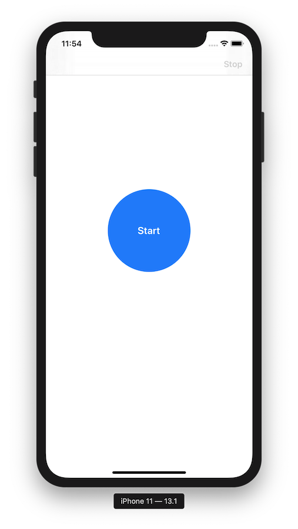

# PhotoPath

## Goal/Reqirements

### User Story

As a user while I go for a walk I want my journey documented by pictures from Flickr along my 
path without having to hold my phone in my hand all the time.

## Challenges 

### Getting the user location in the background 

In my experience, getting the location is always a tradeoff between accuracy and energy 
consumption. The system provides different methods, for example actively using the gps 
hardware, get notified of significant location changes or region monitoring.

#### BoundaryMonitoring

My understanding of this was not to record a high precision track of the walk of the user 
but rather a breadcrumb path. Due to this, my first solution was to use region monitoring: 
I create a boundary around the current location of the user with a radius of 80 m (to approx. 
achieve the 100 m as the system has a cushioning zone around each region) and when
receiving the exit event, fetch an image from Flickr at this poisition and create a new boundary. 
Rinse and repeat until the user hits stop.
Tests with a real device have shown that the energy impact of this solution is low and a 
recording time of 2+ hours can easily be achieved. The app can run in the background or 
even get killed by the system without a problem as the next region exit event will restart it.

#### DistanceMonitoring

In my tests I found out that sometimes the desired accuarcy of 100 m is not achieved. In case 
accuracy is more important then efficiency, I implemented a more 'traditional' approach of 
location tracking by using the more accurate GPS hardware directly and setting 
a `distanceFilter` to 100 m. 
As this uses more energy and the higher image download frequency adds to this toll
this will most likely jeopardise the other requirement of 2+ hours of recording time.

### Getting the authorisation of the user

Since this app depends on always being able to get the users location, it is important to not 
just ask on application launch but on a user interaction. Recent changes in iOS 13 made this 
even harder as for example the option to also track the location in the background („always“)
is not offered right away. 

### Architecture 

I chose to loosely follow a MVVM approach as in my experience this offers a good tradeoff 
between too much boilerplate code and the goal of separating concerns. Usually this works
best when using a reactive extension like RXSwift to connect the layers. Since the challenge 
was to not use external dependencies, I instead used closures. Of course in a more complex 
app this would require a more sophisticated solution. 
To create the user interface, I use Interface Builder as much as possible as in my experience 
layout code especially with auto layout gets very quickly very hard to maintain. Also layouting 
in Interface Builder is the next best thing to hot reload until SwiftUI is in a usable state for 
adoption.
While developing the three core components of the app (monitoring the location, storing a 
track and fetching an image) my goal was to couple them as loosely as possible by using 
simple interfaces and not relying on specific types like CLLocation. To identify a track point 
and link it to its image I create a simple md5 hash of its coordinates.
For communication with Flickr a thin layer on top of URLSession was implemented that 
makes use of Swifts powerful JSON to struct parsing. 

### Real world testing

Location services can easily be simulated and tested in Xcode these days but to see and 
judge real life performance trying it on a device is a must. Without my Mac and Xcode 
directly connected I needed a way to easily see what is happening. For this I created a small 
debug helper that logs the current session and can be shown from within the app. Shake the 
device to see the log output.
There is also the possibility to copy the current track as a .gpx to the pastebard to see exactly
what was recorded.

### Open concept questions

*   What happens if there is no picture available from Flickr for a user location?
*   If there are only a few images from Flicker the API sometimes returns the same image for 
    two locations. Should those be filtered out?
